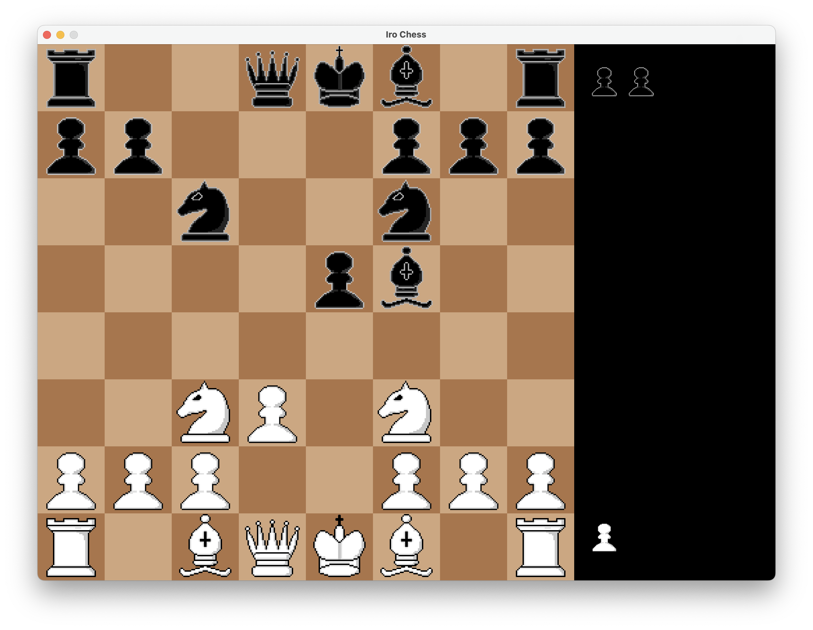

# Iro Chess Gui
A playable chess app built in Java Swing
The engine is built in c in my iro chess repo
https://github.com/Irokanade/iro-chess

## How to play
Drag and drop the pieces to move them

## Screenshots

*The main chess interface*

## Engines
The default uses my custom engine, 
if you want to use your own engine you may add them in the engines directory
