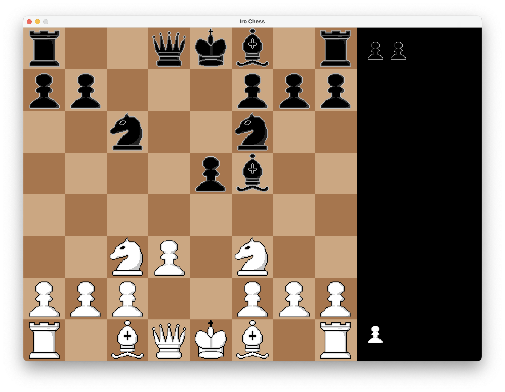

# Iro Chess Gui
A playable chess app built in Java Swing
The engine is built in c in my iro chess repo
https://github.com/Irokanade/iro-chess

## How to play
Drag and drop the pieces to move them

### Running the Game
```bash
./gradlew run
```

### Options
| Flag | Values | Default | Description |
|------|--------|---------|-------------|
| `--opponent` | `white`, `black`, `human` | `black` | Sets who the engine plays as, or `human` for two-player mode |
| `--depth` | any positive integer | `6` | Sets the engine search depth |

#### Examples
Play against the engine (engine plays black):
```bash
./gradlew run --args="--opponent=black"
```
Play against the engine (engine plays white):
```bash
./gradlew run --args="--opponent=white"
```
Play against another human (no engine):
```bash
./gradlew run --args="--opponent=human"
```
Play against the engine at depth 10:
```bash
./gradlew run --args="--opponent=black --depth=10"
```

## C++ Move Generator
The move generator is written in C++ and exposed to Java via JNI. You need to build the shared library before running the game.

### Prerequisites
- CMake 3.15 or higher
- A C++17 compatible compiler
- JDK 21 or higher (for JNI headers)

### Building
```bash
cd src/main/cpp
cmake -B build
cmake --build build
```

This produces `libiro_chess_movegen.dylib` (macOS), `libiro_chess_movegen.so` (Linux), or `iro_chess_movegen.dll` (Windows) in `src/main/cpp/build/`.

### Testing
The build also produces a `chess_engine` executable that runs a perft test to validate the move generator:
```bash
./build/chess_engine
```

## Screenshots

*The main chess interface*

## Engines
The default uses my custom engine, 
if you want to use your own engine you may add the executables to the `/engines` folder under your current os
